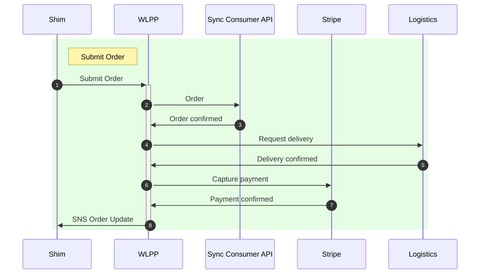
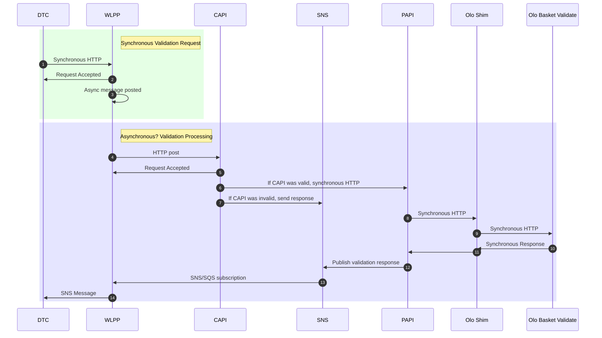
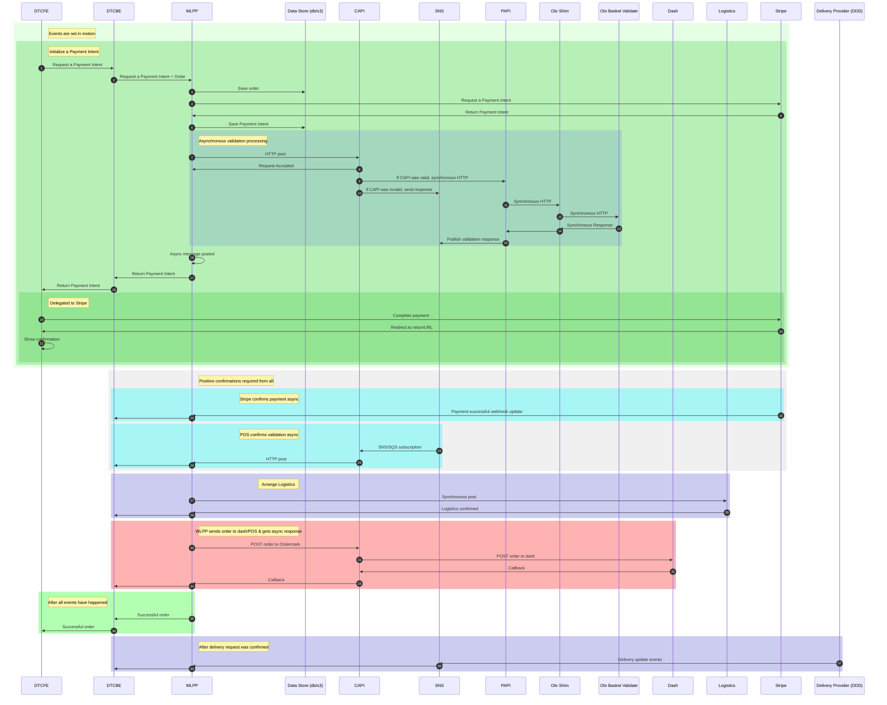
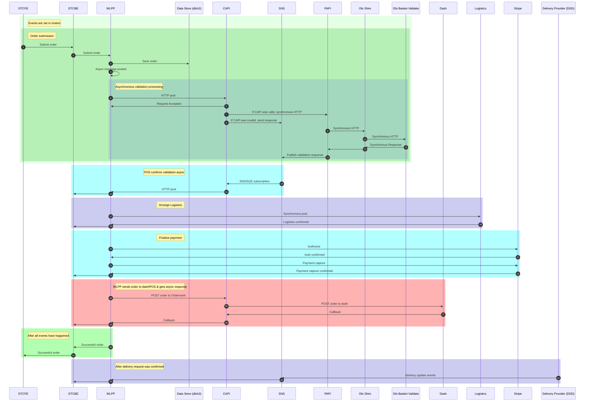
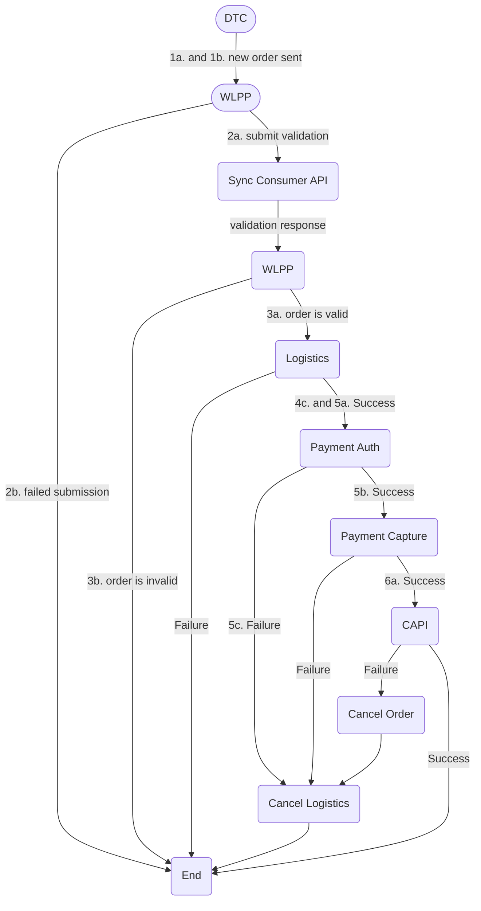

# Logistics Sequence Diagrams



# Mapping of various Ordermark data elements to [DoorDashDrive data elements](https://drive.doordash.com/docs/v1.0/index.html#operation/DeliveryListPost).

| Accounts Service      | Shim         | WLPP                 | Logistics             | DoorDashDrive             | DDD Comment |
| ----------------      | ----         | ----                 | ---------             | -------------             | ----------- |
| address  |  | place | origin | pickup_address ||
| address/phone || place/phone | primary_contact_phone | pickup_phone_number
| | customer_info |  | destination | dropoff_address ||
| | customer_info/address |  | destination/address | customer/address ||
| |  |  |             | customer/business_name ||
| | customer_info/name |  | destination/name | customer/first + last ||
| | customer_info/email |  |  | customer/email || optional - maybe we should withhold |
| | customer_info/phone_number |  | destination/phone | customer/phone_number ||
| |  |  |  | customer/should_send_notifications | true |
| | subtotal_info/subtotal | subtotal_info/subtotal | order/order_total | order_value ||
| | prepare_by_datetime | || pickup_time | specify either pickup_time or delivery_time. Window times can override this.
| | || delivery_by | delivery_time | confusion over times. Window times can override this.
| |  |  | order/items | items | we will skip|
| |  |  |  | team_lift_required| false |
| |  |  |  | barcode_scanning_required | false |
| name   || place/name        || pickup_business_name | brand name that customer is ordering from
| address/name || || pickup_instructions | put the name on the outside of the building where Dasher is picking up food (B&M name)
| | service_info/special_instructions | service_info/special_instructions | special_instructions| dropoff_instructions
| || || order_volume | ?? It's a numeric metric which will be mapped to order of size small,medium,large,xlarge
| | subtotal_info/surcharges | subtotal_info/surcharges | tip | tip | only a specific driver tip gets passed to DDD |
| | order_id | app_id + order_id || external_delivery_id | A unique identifier across all store locations under a business, defined by the merchant, which can be used to track this specific delivery.
| | order_id | || driver_reference_tag | Necessary? The internal order identifier at the merchant, which the driver can use to pick up the order. One example of a value for this field is the number the cashier hands the customer at a counter-serve restaurant.
| | | Legal Entity Name (source for data?) || external_business_name | (skip) DDD autosets this on the account| |  |  |  | ||
| | | app_id | app_id | external_store_id || unique identifier, defined by you
| |  |  |  | contains_alcohol | (skip) false - make this a parameter at Logistics |
| |  |  |  | requires_catering_setup | (skip) false |
| |  |  | order/bag_count | num_items | (skip) 1 |
| |  |  |  | signature_required | (skip) ?? |
| |  |  |  | allow_unattended_delivery | (skip) ?? |
| |  |  |  | cash_on_delivery | (include) Optional value in cents. Default is None |
| |  |  |  | delivery_metadata | (skip) JSON document that allows adding metadata about the delivery such as item weight, size, etc. |
| |  |  |  | allowed_vehicles | (skip) Items Enum: "car" "bicycle" "walker" |
| |  |  |  | is_contactless_delivery | ?? Allows for order to be dropped off without physically handing delivery to consumer |
| | | || | | |  |  |  | ||
| | | || | | |  |  |  | ||
| | | || | | |  |  |  | ||
| | | || | | |  |  |  | ||
| |  |  | vendor_id | | n/a?? Vestigial from Habitat
| |  |  | order_route_name | | Used to identify delivery provider
| |  |  | dashboard_key | | n/a?? 
| name                  |              | concept_name         | restaurant_name | restaurant_name | brand name that customer is ordering from

- Someone (Consumer API or WLPP) needs to know the amount of a concept's delivery charge and add that delivery charge to the validated order response.  It's in the logistics config currently.
- When a tip comes in from Google, does that tip go to DDD?

# Logistics API Format 2021-04-08
```JSON
{
    "origin": {
        "city": "Mahopac",
        "state": "NY",
        "zip": "10541",
        "address": "947 South Lake Blvd"
    },
    "delivery_by": "2019-09-10T22:00:00Z",
    "primary_contact_phone": "8185551212",
    "vendor_id": "x",
    "app_id": "ordermark-denver-demo",
    "special_instructions": null,
    "restaurant_name": "Test Restaurant",
    "order_route_name": "DoorDash Drive Service",
    "dashboard_key": "6742696100626432",
    "destination": {
        "city": "mahopac",
        "name": "Preston Rohner",
        "zip": "10541",
        "phone": "+18184686867",
        "state": "NY",
        "address": "947 s lake blvd"
    },
    "tip": 3.57,
    "order": {
        "items": "[{\"item_number\": 0, \"item_id\": \"71601778\", \"item_name\": \"BBQ Chicken Katsu Bowl\", \"quantity\": 1}, {\"item_number\": 1, \"item_id\": \"71601991\", \"item_name\": \"Sesame Seared Tuna\", \"quantity\": 1}]",
        "order_total": 39.3,
        "bag_count": 1
    }
}
```

# Logistics Mock Delivery Plan

- Order submitted
  - Possibly add flag whether delivery cancel is acceptable to order_json in "ordermark" element.
- Sync Consumer API sends update
  - request_order_delivery() which checks app_id's logistics config.
    - Hit Logistics and get some ID.
      - Do we really need, or want, to hit Logistics?  Maybe just return simulated response from Logistics.
  - Save LogisticsInformation() to S3
  - Message scheduling
    - Add new SNS+SQS with a delay
    - Lambda handler:
      - Receives SQS message
      - Grabs next message in series, updates dates/times, etc.
      - Posts to Logistics endpoint
      - Publishes SNS with subsequent request in series of events, if there are more events in the series

# NOT GONNA HAPPEN - Order Validation Flow - IN-1273



# Complete Order Flow with Payment Intents - Candidate :) 



# Current Order Processing with Olo Validation



## Current Order Processing with Olo Validation

`process_validated_order_updates()` - the bullets (e.g., "1a.") in the diagram map to CloudWatch metrics explained in the bullets below the diagram.



These metrics represent the various steps from the flowchart.
```
1a. "Order Received Async"
1b. "Order Async Processing"
2a. "Order Validation Request Received"
2b. "Order Validation Request Failed"
3a. "Order Validation Response Succeeded"
3b. "Order Validation Response Failed"
4a. "Logistics Not Required"
4b. "Logistics Required"
        "Logistics Phone from Address"
        "Logistics Phone from Brand"
        "Logistics Phone from Brand HACK"
4c. "Logistics Arranged"
5a. "Payment Auth Attempt"
5b. "Payment Auth Success"
5c. "Payment Auth Failed"
6a. "Payment Captured"
```
